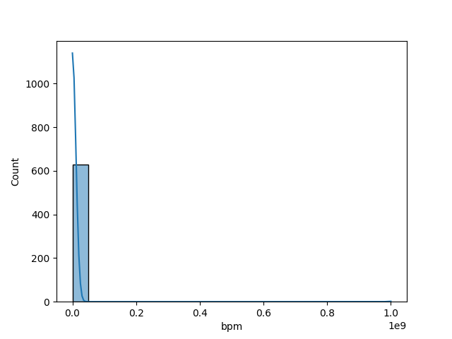
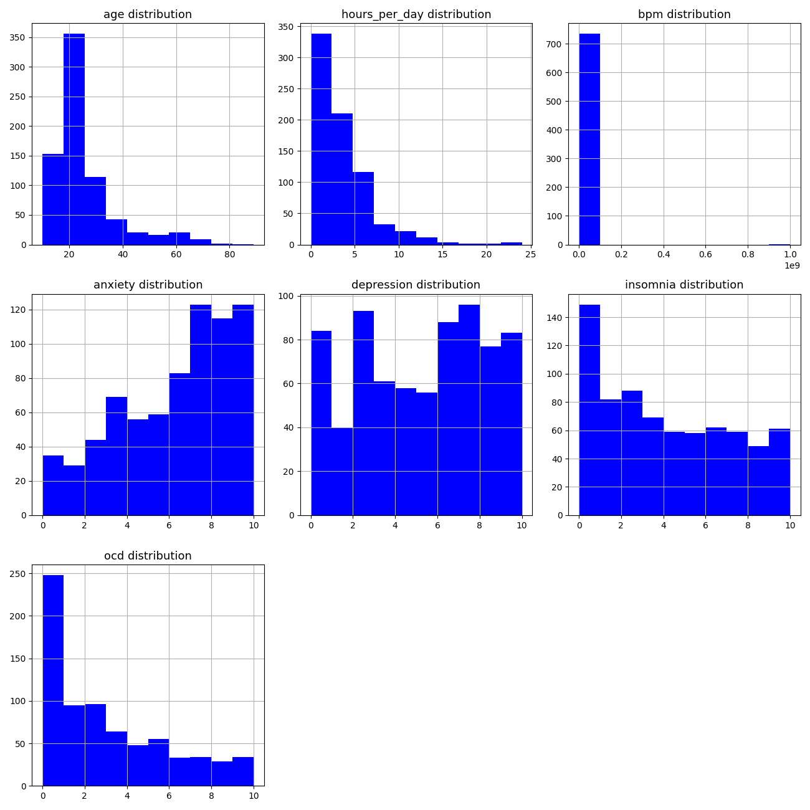
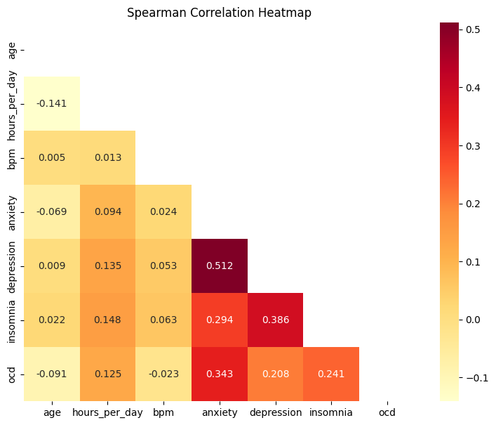
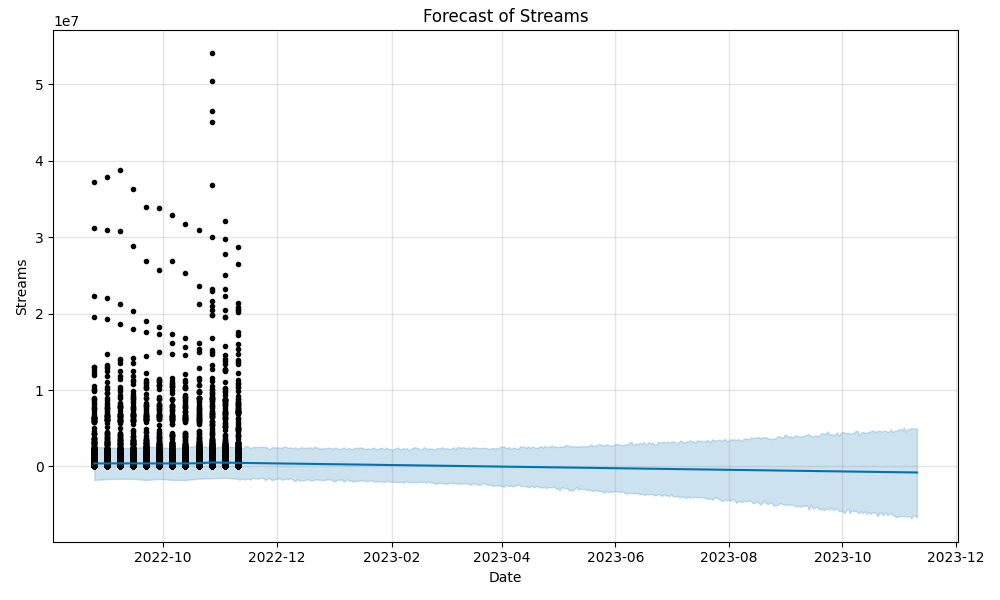
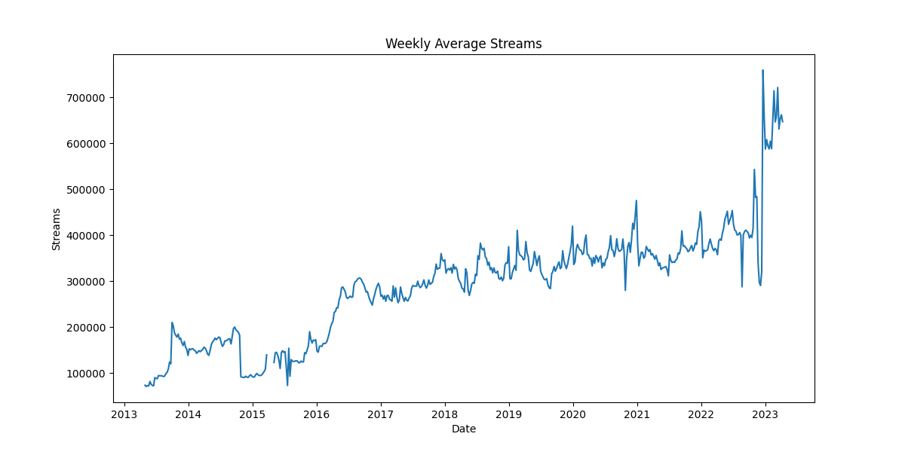

<h1 style="background: linear-gradient(to right, red, orange, yellow); -webkit-background-clip: text; color: transparent; font-weight: bold; font-size: 48px;">Music & Mental Health</h1>


## INTRODUCTION
La música es capaz de afectar nuestras emociones y, en muchos casos, se utiliza para mejorar el estado de ánimo. Sin embargo, la relación entre escuchar música y la salud mental es compleja. Por ejemplo, una persona puede parecer feliz mientras escucha música, como se muestra en la imagen anterior, pero su expresión externa no necesariamente refleja su estado mental interno. Es difícil determinar si quienes escuchan mucha música están naturalmente contentos debido a los efectos positivos de la música o si personas con ansiedad o depresión recurren más a la música como un medio de manejo emocional. Debido complejidades como estas, es importante emplear modelos de Machine Learning y Análisis de Datos para comprender mejor esta dinámica.

## EDA
Se obtuvieron los datos de Kaggle, se importaron librerías y se importó el DataFrame en el Notebook. En primer lugar voy a mostrar lo que sería una línea aleatoria del DataFrame para que se entienda de qué trata (de todas formas en la Metadata se lo explica en detalle).

**Sample Data:**

- **Timestamp:** 9/1/2022 16:35
- **Age:** 63.0
- **Primary streaming service:** Spotify
- **Hours per day:** 2.0
- **While working:** Yes
- **Instrumentalist:** No
- **Composer:** No
- **Favorite genre:** Rock
- **Exploratory:** Yes
- **Foreign languages:** No
- **BPM:** 133.0
- **Frequency [Classical]:** Very frequently
- **Frequency [Country]:** Sometimes
- **Frequency [EDM]:** Rarely
- **Frequency [Folk]:** Very frequently
- **Frequency [Gospel]:** Never
- **Frequency [Hip hop]:** Rarely
- **Frequency [Jazz]:** Sometimes
- **Frequency [K pop]:** Never
- **Frequency [Latin]:** Rarely
- **Frequency [Lofi]:** Never
- **Frequency [Metal]:** Never
- **Frequency [Pop]:** Never
- **Frequency [R&B]:** Rarely
- **Frequency [Rap]:** Never
- **Frequency [Rock]:** Very frequently
- **Frequency [Video game music]:** Never
- **Anxiety:** 5.0
- **Depression:** 4.0
- **Insomnia:** 6.0
- **OCD:** 2.0
- **Music effects:** Improve
- **Permissions:** I understand.


1) Se renombraron los títulos de las columnas siguiendo PEP-8: 

2) Se utilizó una función para ver los nulos en porcentajes y se obtuvieron los siguientes valores.

    ```
    bpm                             14.5%
    music_effects                    1.1%
    instrumentalist                  0.5%
    foreign_languages                0.5%
    while_working                    0.4%
    primary_streaming_service        0.1%
    composer                         0.1%
    age                              0.1%
    frequency_[video_game_music]     0.0%
    frequency_[pop]                  0.0%
    frequency_[r&b]                  0.0%
    frequency_[rap]                  0.0%
    frequency_[rock]                 0.0%
    timestamp                        0.0%
    anxiety                          0.0%
    depression                       0.0%
    frequency_[lofi]                 0.0%
    insomnia                         0.0%
    ocd                              0.0%
    frequency_[metal]                0.0%
    frequency_[hip_hop]              0.0%
    frequency_[latin]                0.0%
    frequency_[k_pop]                0.0%
    frequency_[jazz]                 0.0%
    frequency_[gospel]               0.0%
    ...
    exploratory                      0.0%
    fav_genre                        0.0%
    hours_per_day                    0.0%
    permissions                      0.0%
    ```

    Sin ser por la columna 'bpm', hay pocos nulos en el DataFrame. Pero primero vimos la distribución de 'bpm' pues es la más inquietante.

    

    De la imágen de arriba se puede ver que hay mucha skewness junto con muchos outliers. No sería correcto imputar con la media. Se deició imputar los nulos con la mediana.

3) No había filas duplicadas, por lo que no se hizo nada respecto a ese tema
4) Se hicieron ciertas gráficas de Histogramas, Heatmaps (entre otras cosas) para tener una primera visualización de los datos.

    
    


    Se puede observar que hay correlaciones bastante bajas entre las variables numéricas, lo cual en general es bueno si se da entre las variables independientes (ningún valor supera 0.9 así que no fue necesario droppear variables por el momento). Con la target en cambio, es bueno que tenga buena correlación con las independientes. También se puede notar que hay ciertos outliers que se podrían eliminar y algunas distribuciones están lejos de una normal por lo que habría que hacerles tratamiento.

## Preprocessing

Se le aplicaron transformaciones logarítmicas o de raiz cuadrada (en caso de ser necesario) a cada una de las variables numéricas para que queden con una forma más normal. También se hizo un tratamiento de Outliers.

Luego de los cambios, algunos de los histogramas cambiaron un poco mientras que el Heatmap queedó escencialmente igual.

Se hizo un VIF para ver si se podía droppear alguna variable, ya que el Heatmap solo sirve para ver correlaciones de a pares de variables:

| Variable   | VIF      |
|------------|----------|
| age        | 5.961786 |
| bpm        | 1.008772 |
| anxiety    | 7.997704 |
| depression | 5.336664 |
| insomnia   | 2.996676 |
| ocd        | 2.201696 |


Ningún valor superó un valor de 10 --> No nos cargamos variables


Luego para las variables categóricas,
se hizo una función para eliminar las columnas que eran específicamente para un género. A modo de disminuir la cantidad de variables para el modelo debido a que son demasiadas. De todas formas, mantuve la de género favorito que en cierta forma las contempla.
También quité 'Permissions' y 'timestamp' pues no eran relevantes para los modelos.

Se hizo un Test de Chi2 para variables nominales y nos cargamos 'primary_streaming_service'

Se realizó un Label Encoder para la única variable nominal que quedaba ('fav_genre') y un OneHotEncoder para el resto de las categóricas.

Una vez que todas las variables estaban en formato numérico, podemos comenzar con el modelo.

## Linear Regression Model

Elegí como variable target a la cantidad de horas de música escuchadas por día. En un principio la elegí porque me daba curiosidad saber el resultado. Luego veremos cuál es la más eficiente para obtener un mejor modelo. A continuación presento un resumen del modelo aplicado.

```python
X_num = data.select_dtypes(include=np.number).drop(columns=['hours_per_day'])
X_cat = data.select_dtypes(include=object)
Y = data['hours_per_day']
```


Apliqué transformaciones de normalización y estandarización. Usé el OneHotEncoder y Label Encoder (como se dijo anteriormente) y luego concatené las variables categóricas con las numéricas para obtener la variable X que se utilizó en el modelo. Usé un train, test, split y luego ejecuté el modelo. Estos fueron los resultados obtenidos de este primer modelo (utilizando normalización):


```python
 OLS Regression Results                            
==============================================================================
Dep. Variable:          hours_per_day   R-squared:                       0.226
Model:                            OLS   Adj. R-squared:                  0.183
Method:                 Least Squares   F-statistic:                     5.299
Date:                Mon, 17 Jun 2024   Prob (F-statistic):           1.10e-15
Time:                        11:51:09   Log-Likelihood:                -471.29
No. Observations:                 537   AIC:                             1001.
Df Residuals:                     508   BIC:                             1125.
Df Model:                          28                                         
Covariance Type:            nonrobust                                         
===========================================================================================
                              coef    std err          t      P>|t|      [0.025      0.975]
-------------------------------------------------------------------------------------------
const                      -0.1914      1.057     -0.181      0.856      -2.269       1.886
feature_0                  -2.6350      3.650     -0.722      0.471      -9.806       4.536
feature_1                   1.2411      0.969      1.280      0.201      -0.663       3.146
feature_2                   1.1202      1.321      0.848      0.397      -1.475       3.715
feature_3                   0.5225      1.102      0.474      0.635      -1.642       2.687
feature_4                   0.9277      1.043      0.889      0.374      -1.122       2.978
feature_5                   1.5693      0.990      1.586      0.113      -0.375       3.513
while_working_Yes           0.5675      0.069      8.228      0.000       0.432       0.703
instrumentalist_Yes        -0.1911      0.064     -2.964      0.003      -0.318      -0.064
composer_Yes                0.2786      0.079      3.525      0.000       0.123       0.434
fav_genre_1                 0.1339      0.173      0.774      0.440      -0.206       0.474
...
==============================================================================
```


Se puede ver que el R2=0.226 dio bastante, y el R2 ajustado dio aun más bajo, lo cual indica que probablemente hubo overfitting. Varios p-valores dieron muy altos, más de los que aparecen en el resumen de arriba. Probé estandarizar pero los resultados fueron muy similares.
Ir quitando los p-valores en forma manual (dada la cantidad) no parecía lo más sensato por lo que decidí hacer un embedded con Ridge, el cual tampoco mejoró mucho el panorama. 
Entonces decidí cambiar la variable target, ya que viendo el Heatmap, tenía baja correlación con las demás. Probé usar 'depression' ya que parecía una buena candidata para mejorar el modelo.

Esta vez los resultados dieron un poco más razonables pero aún siguía habiendo problemas con los p-values, como se muestra a continuación:


```python

    OLS Regression Results                            
==============================================================================
Dep. Variable:             depression   R-squared:                       0.708
Model:                            OLS   Adj. R-squared:                  0.693
Method:                 Least Squares   F-statistic:                     47.61
Date:                Mon, 17 Jun 2024   Prob (F-statistic):          1.37e-118
Time:                        11:51:09   Log-Likelihood:                -1017.9
No. Observations:                 537   AIC:                             2090.
Df Residuals:                     510   BIC:                             2206.
Df Model:                          26                                         
Covariance Type:            nonrobust                                         
===========================================================================================
                              coef    std err          t      P>|t|      [0.025      0.975]
-------------------------------------------------------------------------------------------
const                      -2.9814      0.534     -5.583      0.000      -4.031      -1.932
feature_0                   1.7397      0.409      4.250      0.000       0.935       2.544
feature_1                  10.9828      0.343     31.987      0.000      10.308      11.657
feature_2                   2.3597      0.325      7.251      0.000       1.720       2.999
feature_3                   2.2077      0.328      6.735      0.000       1.564       2.852
while_working_Yes           0.0910      0.188      0.483      0.629      -0.279       0.461
instrumentalist_Yes        -0.0261      0.177     -0.147      0.883      -0.375       0.322
composer_Yes                0.1491      0.217      0.686      0.493      -0.278       0.576
fav_genre_1                -0.2955      0.477     -0.619      0.536      -1.233       0.642
fav_genre_2                 0.0358      0.414      0.086      0.931      -0.778       0.849
fav_genre_3                 0.4923      0.425      1.159      0.247      -0.342       1.327
...
==============================================================================

R-squared value on training set: 0.71
R-squared value on test set: 0.73
Intercept of the model: -2.981384061400541
MSE: 2.4107232238728558

```
Debido a los problemas ocasionados con esta gran cantidad de variables, decidí usar un PCA para simplificar la situación
e intentar mejorar el modelo.

Haciendo pruebas con el PCA, llegué a que la mejor cantidad de componentes era 22 y obtuve los siguientes resultados:


```python
OLS Regression Results                            
==============================================================================
Dep. Variable:             depression   R-squared:                       0.708
Model:                            OLS   Adj. R-squared:                  0.695
Method:                 Least Squares   F-statistic:                     56.52
Date:                Mon, 17 Jun 2024   Prob (F-statistic):          8.25e-122
Time:                        11:51:10   Log-Likelihood:                -1018.5
No. Observations:                 537   AIC:                             2083.
Df Residuals:                     514   BIC:                             2182.
Df Model:                          22                                         
Covariance Type:            nonrobust                                         
==============================================================================
                 coef    std err          t      P>|t|      [0.025      0.975]
------------------------------------------------------------------------------
const          5.0475      0.071     70.968      0.000       4.908       5.187
x1            -0.3612      0.129     -2.804      0.005      -0.614      -0.108
x2            -0.0784      0.137     -0.572      0.568      -0.348       0.191
x3             1.0320      0.157      6.583      0.000       0.724       1.340
x4             0.4222      0.163      2.592      0.010       0.102       0.742
x5            -0.5400      0.174     -3.110      0.002      -0.881      -0.199
x6            -0.9307      0.189     -4.924      0.000      -1.302      -0.559
x7             0.2177      0.193      1.128      0.260      -0.162       0.597
x8             0.7217      0.225      3.206      0.001       0.279       1.164
x9             1.2590      0.231      5.450      0.000       0.805       1.713
x10            1.0940      0.261      4.193      0.000       0.581       1.606
...
==============================================================================

R-squared en conjunto de entrenamiento: 0.71
R-squared ajustado en conjunto de entrenamiento: 0.7
R-squared en conjunto de prueba: 0.73
Intercepto del modelo: 5.047486033519557
Error cuadrático medio (MSE) en conjunto de prueba: 2.3961762611828337
```
Esta vez hubo menos problemas. El modelo se iba acercando a tener buenos resultados. Luego de algunos ajusted con pocos p-valores
se llegó a este resultado que terminó siendo el final:

```python

OLS Regression Results                            
==============================================================================
Dep. Variable:             depression   R-squared:                       0.663
Model:                            OLS   Adj. R-squared:                  0.652
Method:                 Least Squares   F-statistic:                     60.19
Date:                Mon, 17 Jun 2024   Prob (F-statistic):          8.66e-111
Time:                        11:51:10   Log-Likelihood:                -1056.2
No. Observations:                 537   AIC:                             2148.
Df Residuals:                     519   BIC:                             2226.
Df Model:                          17                                         
Covariance Type:            nonrobust                                         
==============================================================================
                 coef    std err          t      P>|t|      [0.025      0.975]
------------------------------------------------------------------------------
const          5.0475      0.076     66.482      0.000       4.898       5.197
x1            -0.3612      0.138     -2.627      0.009      -0.631      -0.091
x2             1.0320      0.167      6.167      0.000       0.703       1.361
x3             0.4222      0.174      2.428      0.016       0.081       0.764
x4            -0.5400      0.185     -2.913      0.004      -0.904      -0.176
x5            -0.9307      0.202     -4.612      0.000      -1.327      -0.534
x6             0.7217      0.240      3.003      0.003       0.250       1.194
x7             1.2590      0.247      5.105      0.000       0.775       1.744
x8             1.0940      0.278      3.928      0.000       0.547       1.641
x9            -6.0840      0.294    -20.678      0.000      -6.662      -5.506
x10           -3.1431      0.301    -10.456      0.000      -3.734      -2.553
...
==============================================================================

```
### Conclusiones

Para este project, la consigna era aplicar un modelo de Regresión Lineal (además del que viene a continuación) a los datos pero entiendo quizás no era el modelo que más se ajustaba a mis datos y por eso los resultados no fueron ideales. Sin embargo, se logró mejorar el modelo lo suficiente como para tener resultados razonables. Los R2 dieron casi idénticos, 0.66 y 0.65. Son decentemente buenos y logramos quitar todos los p-valores que fueran mayores a 0.05. Que el p-valor: Prob (F-Statistic) haya dado extremadamente bajo (a efectos prácticos sería 0) significa que el modelo en general es significativo. Fue crucial tomar la decisión de cambiar de variable target y hacer un modelo PCA para poder obtener los resultados finales.


## Time Series Analysis

La otra gran parte de la consigna era hacer un análisis de Series de Tiempo.
Se eligió otro dataset pues el anterior no funcionaba para un análisis de tiempo (la columna timestamp no tenía ninguna aplicación relevante). Este dataset trata sobre Spotify.
No fue necesario hacerle limpieza pues vino limpio. 
Se quiere analizar cómo varía la cantidad de streams (cantidad de reproducciones de la canción en cuestión) con el paso del tiempo.
Dado que el dataframe del modelo anterior era de fines del 2022, se decidió "recortar" este DataFrame (con filtros en Excel) para que estén referidos al mismo período y puedan ser comparados. A su vez, el dataframe de Spotify tiene mas de 1 millon de filas, lo cual hace que el Prophet ande lento pero igualmente se lo incluyó y se le hizo un análisis en chunks para acelerar el proceso.




Del Forecast se puede ver que se agranda un poco el abanico pero no demasiado. Es decir, el modelo tiene buena capacidad predictiva. A su vez, en la parte de la gráfica que tiene datos reales, la tendencia es bastante constante, lo cual también da confianza para predecir. 




En cambio en este gráfico ya se ve una tendencia creciente. Tiene sentido porque aplicaciones como Spotify, etc, usan sistemas de recomendación de canciones que hagan que los usuarios pasen más tiempo dentro de las aplicaciones. Además, hoy en día los artistas aparecen en las redes sociales mucho más que en el 2013 por ejemplo (cuando comienza el período del dataset) lo cual hace que los fans puedan mantener interés en sus canciones.
Los avances en la tecnología hacen que las canciones puedan tener una mejor producción. También generan mejorar en dispositivos para escuchar música, como pueden ser los auriculares, que hacen que la gente sea más dependiente de escuchar música. 

Estos factores pueden generar adicción en las personas para escuchar música. Si bien se habló de horas escuchadas, efectos musicales, etc, no había ninguna variable específicamente referida a la adicción de los usuarios. Uno de los motivos por los cuales me interesó usar como target la variable de horas escuchadas por día es porque sé que tener modelos que sean útiles para predecirla pueden ser muy útiles para sacar estadísticas ya que muchos jóvenes son adictos a escuchar música (y entre otras cosas se les puede perjudicar mucho la audición).

====================================================================================================================

## **Nota**:
 El dataset completo de Spotify (spotify.csv) es muy grande como para subirlo en el repositorio de Github, pero puedes descargarlo mediante este link: https://www.kaggle.com/datasets/jfreyberg/spotify-chart-data

 De todas formas, está subido el que se llama cortito.xlsxv, que es una porción del original. En cuanto al dataset de la primera parte (music.csv) también está subido.
